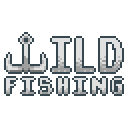
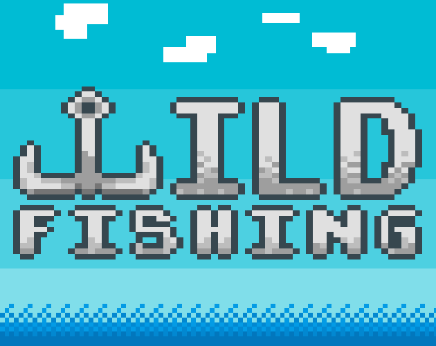

	<a href="https://github.com/ClarkThyLord/Wild-Fishing">
		
		<h1 align="center">
			Wild-Fishing
		</h1>
	</a>

	
	
	

> 2D Fishing game made with Godot, for the Godot Wild Jam #41

---

	

# About
Wild-Fishing is a 2D fishing game made with [Godot](https://github.com/godotengine/godot), made in a week for the [Godot Wild Jam #41](https://itch.io/jam/godot-wild-jam-41).

## [Godot Wild Jam #41](https://itch.io/jam/godot-wild-jam-41)
Godot Wild Jam which starts the second weekend of every month.  Whether you're a person who likes to go wild,  a casual game developer, a Godot fan, or you just stumbled upon the engine recently and would like to have a go at it, then this is the event for you.
